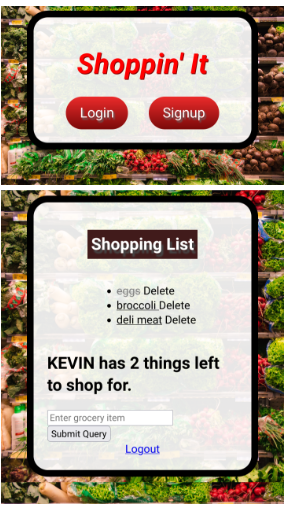

<td width="50%" valign="top"> <!--Start of Shoppin' It taking 50% of view window-->
      <h3 align="center">Shoppin' It (Group Project)</h3>
        <!--Click the Shoppin'It image to open a new window to Nasa API website-->
      </a>
       
      
 <!--Click repo icon link to open a new window to Shoppin'It Group Project GitHub repo-->
       <!--Click website icon link to open a new window to Shoppin'It Group Project website-->
      
      
 <!--Desciption of technologies and functionality of Shoppin'It Group Project-->
        
<strong>MVC, HTML, CSS, JS, Node.js, Express.js, Mongoose, MongoDB, Passport.js, Session, Flash, Morgan, dotenv, Git/Github, Heroku</strong> - Signup to create an account and login to your groceries list. Full stack MVC CRUD app allowing you get your grocery list, add new groceries, update your grocery list by marking out groceries shopped and delete groceries.Hosted on Heroku for back end application.

    </td> <!--End of Shoppin'It Group Project-->

---
# Introduction

A Simple ToDo App is built using the MVC Architecture, we have also implemented "authorization" so folx can sign up, customize & personalize the app 

---

> Be sure to add that lovely star 😀 and fork it for your own copy

---

# Objectives

- It's a beginner level app created to understand how MVC concept and logins are added

---

# Who is this for? 

- It's for beginners & intermediates with little more experience, to help understand the various aspects of building a node app with some complex features

---

# Packages/Dependencies used 

bcrypt, connect-mongo, dotenv, ejs, express, express-flash, express-session, mongodb, mongoose, morgan, nodemon, passport, passport-local, validator

---

# Install all the dependencies or node packages used for development via Terminal

`npm install` 

---

# Things to add

- Create a `.env` file in the config folder and add the following as `key: value` 
  - PORT: 2121 (can be any port example: 3000) 
  - DB_STRING: `your database URI` 
 ---
 
 Have fun testing and improving it! 😎

NOTES:
09/01/2022
Updated API in .env file.

9/2/2022
Fixed CSS linking (issue was that it needed to point to CSS subfolder) and did some basic styling on the main page - Donny

9/7/2022
Fixed CSS shrinking background for Shopping List todo.ejs render on mobile devices. - Kevin discord KevinTap#0955

---

CHATTER:

Tested the app locally instead of replit and it works! Woo! Login, sign up, adding items, deleting items, logging out all work correctly.

re: Interesting. I wonder what the issue is getting it to work on Replit. Maybe we can just collab on ideas/code here and clone it down for testing/final product. I tried setting up a CodePen Pro for collaboration, but it doesn't appear to support Full Stack apps very well, at least from what I can tell.- Donny

Melinna had an idea of setting up a Discord for easier collaboration as well, which I agree with. I think it will make working on things a bit easier if y'all are down for it. I'll have time to work on it this weekend to add features, etc. Also, there's a chat window in the bottom right that I just noticed! - Donny

I commented out the js files. Please feel free to correct my spelling or wording for better descriptions. - Kevin discord KevinTap#0955

Something I do commonly with my code for server.js is log to the console localhost:${process.env.PORT} so that I don't have to go digging for the port.
I added this to the app.listen. - Kevin discord KevinTap#0955

In the css file I noticed the background color was shrinking behind the h1. I changed the width: 20% to min-width:20% to prevent this. I added a media query for mobile screen size 440px and under to resize the main header Shoppin' It font size. I'd like to change the layout of the form inputs aswell. - Kevin discord KevinTap#0955

In the todos.ejs I changed the h1 to Shopping List so that the todos page title says Shopping List and added padding: 5px so that the lowercase p would not exceed the background color. I put the user name to caps on the h2 using .toUpperCase() and changed the contents to say things left to shop for. I changed the form placeholder to say Enter grocery item. - Kevin discord KevinTap#0955

# Melinna: 
Ok, I got it all to work. So Replit's "Webview" tab is...well it's trash. So open the webview in a new window (on the Webview, it's the 3rd button to the left of the URL) and you will be able to either create a new user or log in. 

 I got the actual list CSS to work now as well. 

 ok, so I updated some CSS, and fixed some minor issues. All should be working. If not, message me on discord Rupert#6112.
